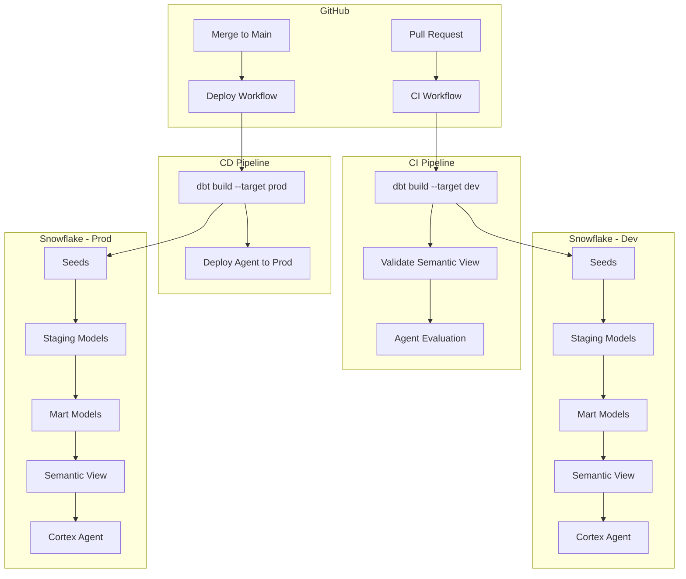

# Cortex Agent CI/CD Demo

End-to-end demonstration of CI/CD for Snowflake Cortex Agents using dbt and the `dbt_semantic_view` package.

## Architecture



## Components

| Component | Description |
|-----------|-------------|
| **dbt Models** | Staging + mart layer transforming raw retail data |
| **Semantic View** | `dbt_semantic_view` materialization with dimensions, facts, metrics |
| **Cortex Agent** | Q&A agent backed by semantic view via Analyst Tool |
| **Evaluation** | Automated agent testing with score thresholds |
| **GitHub Actions** | CI on PR (build + eval), CD on merge (deploy to prod) |

## Project Structure

```
agent-ci-cd/
├── dbt_project.yml
├── profiles.yml
├── packages.yml
├── models/
│   ├── sources.yml
│   ├── staging/          # stg_customers, stg_orders, stg_products, stg_order_items
│   ├── marts/            # dim_customers, dim_products, fct_orders
│   └── semantic/         # retail_analytics (semantic view)
├── seeds/                # Sample retail data CSVs
├── macros/               # generate_schema_name
├── deploy/
│   ├── setup_snowflake.sql    # One-time Snowflake setup
│   ├── create_agent.sql       # Agent DDL
│   └── deploy_agent.sh        # Deploy script
├── evaluation/
│   ├── eval_dataset.sql       # Test questions + expected answers
│   └── run_eval.sql           # Evaluation runner
├── scripts/
│   ├── check_eval_results.py  # CI eval checker
│   └── requirements.txt       # Python dependencies
└── .github/workflows/
    ├── ci.yml                 # PR validation
    └── deploy.yml             # Production deployment
```

## Setup

### Prerequisites

- Snowflake account with Cortex Agent access
- GitHub repository with Actions enabled
- Python 3.11+ and dbt-snowflake installed locally

### 1. Snowflake Setup (one-time)

Run the setup script to create databases, warehouse, and roles:

```bash
snow sql -f deploy/setup_snowflake.sql
```

### 2. Configure GitHub Secrets

Add these secrets to your GitHub repository:

| Secret | Description |
|--------|-------------|
| `SNOWFLAKE_ACCOUNT` | Your Snowflake account identifier |
| `SNOWFLAKE_USER` | Service account username |
| `SNOWFLAKE_PASSWORD` | Service account password |
| `SNOWFLAKE_ROLE` | Role with necessary privileges (e.g., `AGENT_CICD_ROLE`) |
| `SNOWFLAKE_WAREHOUSE` | Warehouse name (e.g., `AGENT_CICD_WH`) |

### 3. Local Development

```bash
# Install dependencies
pip install dbt-snowflake snowflake-connector-python

# Install dbt packages (including dbt_semantic_view)
dbt deps --profiles-dir .

# Set environment variables
export SNOWFLAKE_ACCOUNT=your_account
export SNOWFLAKE_USER=your_user
export SNOWFLAKE_PASSWORD=your_password
export SNOWFLAKE_ROLE=AGENT_CICD_ROLE
export SNOWFLAKE_WAREHOUSE=AGENT_CICD_WH

# Build everything in dev
dbt build --target dev --profiles-dir .
```

### 4. Deploy Agent

```bash
# Deploy to dev
./deploy/deploy_agent.sh dev

# Deploy to prod (after merge)
./deploy/deploy_agent.sh prod
```

## CI/CD Flow

### On Pull Request (ci.yml)
1. **dbt build** - Seeds data, runs models, executes tests in dev
2. **Semantic view validation** - Confirms the view exists with expected components
3. **Agent evaluation** - Deploys agent to dev, runs evaluation dataset, asserts score thresholds

### On Merge to Main (deploy.yml)
1. **dbt build** - Full build against production database
2. **Deploy agent** - Creates/replaces the Cortex Agent in production

## Evaluation Thresholds

The CI pipeline enforces minimum scores:

| Metric | Threshold | Description |
|--------|-----------|-------------|
| Tool Selection Accuracy | 0.80 | Agent selects the correct tool |
| Answer Correctness | 0.60 | Response matches expected answer |
| Logical Consistency | 0.70 | Reasoning is coherent across steps |

## Making Changes

1. Create a feature branch
2. Modify models, semantic view, or agent config
3. Open a PR - CI validates automatically
4. On approval + merge - deploys to production

## Key Technologies

- [dbt](https://www.getdbt.com/) - Data transformation framework
- [dbt_semantic_view](https://hub.getdbt.com/Snowflake-Labs/dbt_semantic_view/latest/) - Semantic view materialization
- [Snowflake Cortex Agent](https://docs.snowflake.com/en/user-guide/snowflake-cortex/cortex-agents) - AI agent framework
- [Cortex Agent Evaluations](https://docs.snowflake.com/en/user-guide/snowflake-cortex/cortex-agents-evaluations) - Agent testing
- [GitHub Actions](https://github.com/features/actions) - CI/CD automation
